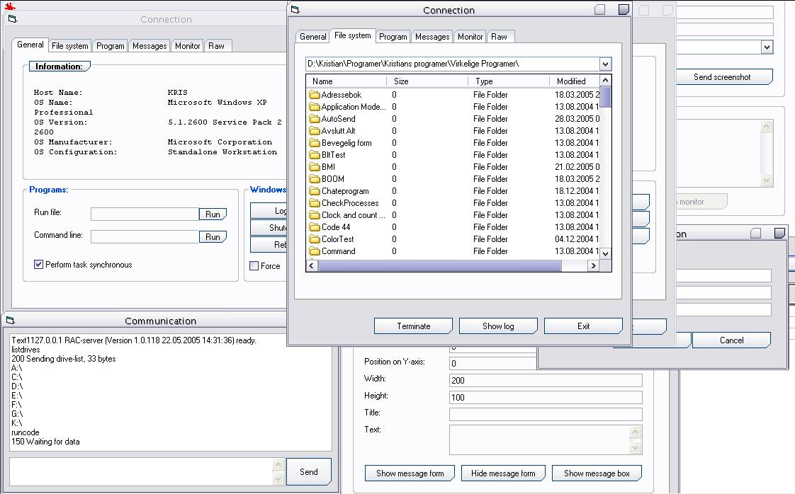

## RemoteAdministration

### Description

When installed on a remote computer, this program let you perform numerous tasks on that computer. With a easy and intuitive client, you can force termination of Windows; run programs or DOS-commands; get information about the remote computer; list, delete, download and upload files and folders; add logon username and password to the remote program; send messages and draw directly on top window; and get screenshot and monitor keyboard. The possibilities are endless.
 
### More Info
 

             |
---                |---
**Submitted On**   |2005-05-22 14:38:44
**By**             |[Kristian S\. Stangeland](https://github.com/Planet-Source-Code/PSCIndex/blob/master/ByAuthor/kristian-s-stangeland.md)
**Level**          |Advanced
**User Rating**    |5.0 (10 globes from 2 users)
**Compatibility**  |VB 5\.0, VB 6\.0
**Category**       |[Complete Applications](https://github.com/Planet-Source-Code/PSCIndex/blob/master/ByCategory/complete-applications__1-27.md)
**World**          |[Visual Basic](https://github.com/Planet-Source-Code/PSCIndex/blob/master/ByWorld/visual-basic.md)
**Archive File**   |[RemoveAdmi1890575222005\.zip](https://github.com/Planet-Source-Code/kristian-s-stangeland-remoteadministration__1-60622/archive/master.zip)

### API Declarations

Too many.

